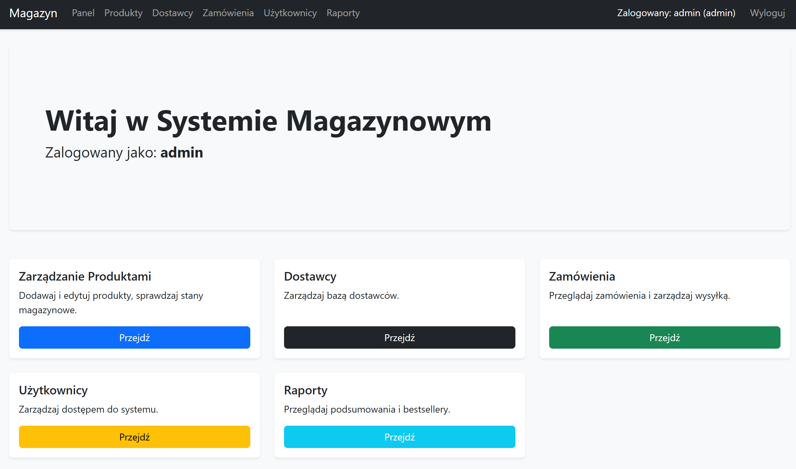
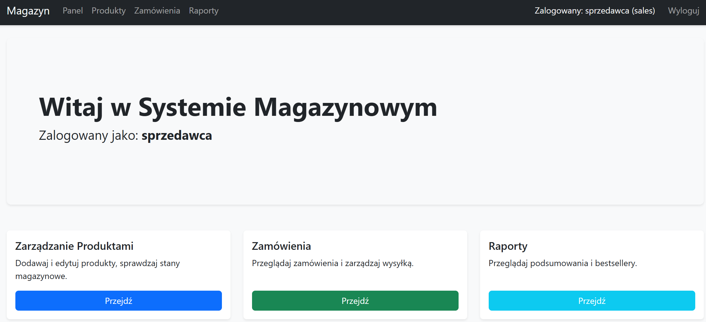
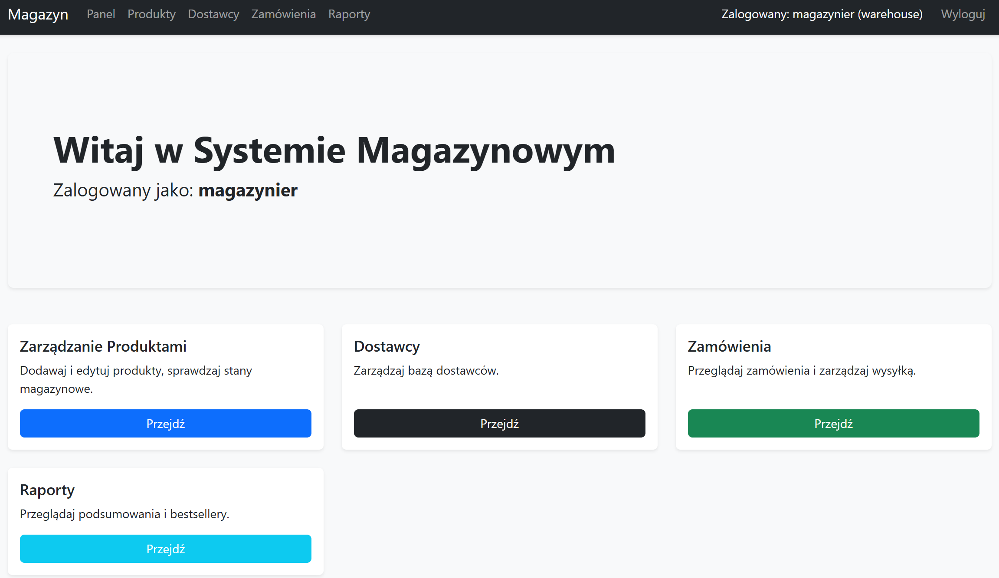

# Warehouse Management System

Warehouse Management System is a Flask and PostgreSQL web application for managing products, suppliers, users, customer orders, and inventory reporting. The project is intentionally built around raw SQL and database-side business rules, with PostgreSQL triggers and views enforcing stock and price-history behavior.

## Overview

This project covers a typical small-business warehouse workflow:

- authenticate users and restrict access by role
- maintain a product catalog and supplier list
- create customer orders
- decrease stock automatically when order items are inserted
- track product price changes
- expose operational reports directly from SQL views

The UI is server-rendered with Jinja2 templates and Bootstrap. The application logic stays relatively thin while the database handles consistency-sensitive operations.

## Main Features

### Role-Based Access

- `admin` can manage users and access all application areas
- `warehouse` can manage products and suppliers
- `sales` can create and process orders

### Inventory And Orders

- products include SKU, price, stock, and supplier assignment
- orders support multiple line items
- stock is reduced automatically by a PostgreSQL trigger
- orders cannot be created when stock is insufficient

### Audit And Reporting

- price changes are written automatically to `price_history`
- reporting is built from SQL views, including:
  - order summary
  - bestsellers
  - low stock
  - supplier inventory value
  - sales by employee
  - worst sellers

## Screenshots

Selected role-based spaces:

### Admin Space



### Sales Space (`sprzedawca`)



### Warehouse Space (`magazynier`)



## Technical Approach

The application uses a "thick database" approach:

- Flask handles routing, sessions, form processing, and page rendering
- PostgreSQL handles constraints, triggers, and reporting views
- `psycopg2` is used directly instead of an ORM

Important database behaviors defined in [`schema.sql`](schema.sql):

- `update_stock_level` prevents negative stock during order creation
- `log_price_change` records old and new product prices
- reporting views provide read-only analytical queries for the UI

## Stack

- Python
- Flask
- PostgreSQL 15
- `psycopg2`
- Jinja2
- Bootstrap 5
- Docker Compose

## Quick Start

### Run With Docker

1. Create a local environment file:

   ```bash
   cp .env.example .env
   ```

2. Set at least:

   - `DB_PASSWORD`
   - `SECRET_KEY`

3. Start the application:

   ```bash
   docker compose up --build
   ```

4. Open the login page:

   [http://localhost:5000/login](http://localhost:5000/login)

### Run Locally

1. Create `.env` from [`.env.example`](.env.example).
2. Install dependencies:

   ```bash
   pip install -r requirements.txt
   ```

3. Make sure PostgreSQL is available locally.
4. Initialize the schema and seed data:

   ```bash
   python reset_db.py
   ```

5. Start the app:

   ```bash
   python app.py
   ```

## Configuration

See [`.env.example`](.env.example) for the expected variables.

Current runtime requirements:

- `SECRET_KEY` is mandatory; the app will not start without it
- for Docker, the application connects to PostgreSQL with `DB_HOST=db`
- for local execution, `DB_HOST=localhost` is expected

## Demo Accounts

The seed data creates three sample users for local development:

- `admin` / `admin123`
- `magazynier` / `user123`
- `sprzedawca` / `user123`

These accounts are intended for demonstration and local testing only.

## Project Layout

```text
app.py                Flask application entrypoint and routes
db.py                 Database connection helper
schema.sql            Tables, triggers, views, and seed data
reset_db.py           Local database reset/bootstrap script
templates/            Jinja2 templates
docs/screenshots/     Selected UI screenshots used in this README
Dockerfile            Web image definition
docker-compose.yml    Application and PostgreSQL services
.env.example          Example environment configuration
```

## Notes

- The repository includes seed data so the application can be explored immediately after setup.
- Database errors are logged server-side; end users receive generic error messages.
- The Docker configuration is intended for local development and demonstration.

## License

This project is licensed under the GNU Affero General Public License v3.0. See [LICENSE](LICENSE).
